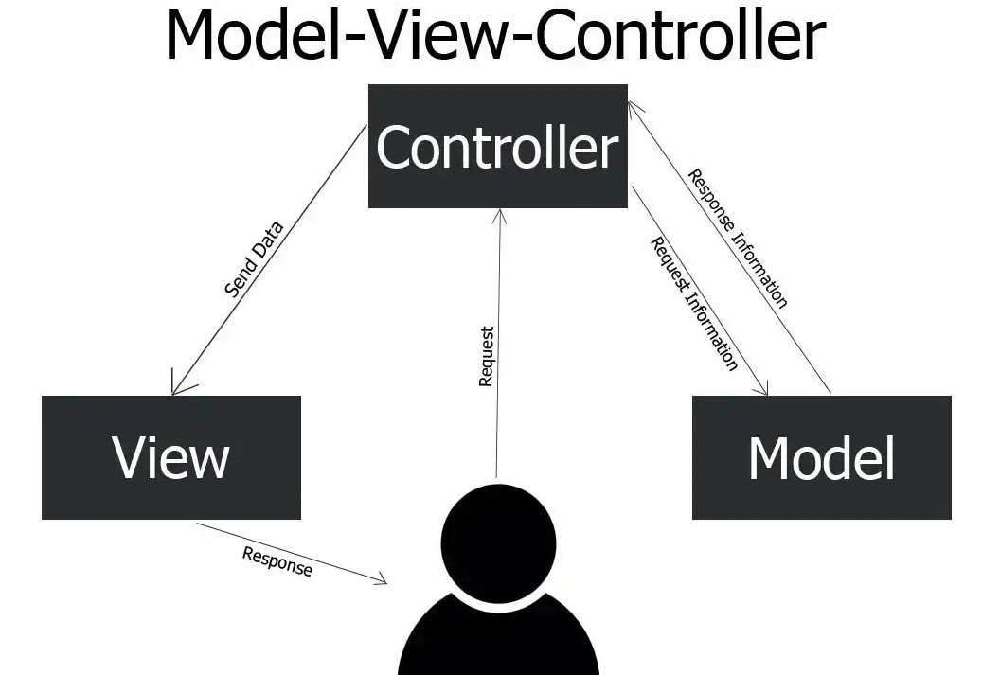

# Node Blog CRUD

### Descrição

Este é um projeto de blog desenvolvido com **Node.js**, **Express** e **MySQL** para gerenciar artigos e categorias. Ele permite realizar operações de CRUD (Create, Read, Update, Delete) tanto para artigos quanto para categorias.

Este projeto utiliza padrão de arquitetura de software MVC que divide uma aplicação em três camadas: Model (modelo), View (visão) e Controller (controle).

<div align="center">
  
</div>

---

## Tecnologias Utilizadas

<div style="display: flex; flex-direction: row;">
  <div style="margin-right: 20px; display: flex; justify-content: flex-start;">
    
  </div>
    <div style="margin-right: 20px; display: flex; justify-content: flex-start;">
    
  </div>
  <div style="margin-right: 20px; display: flex; justify-content: flex-start;">
    
  </div>
</div>

---

## Funcionalidades

1. **CRUD de Categorias**:

   - Criar, listar, editar e excluir categorias.

2. **CRUD de Artigos**:

   - Criar, listar, editar e excluir artigos.

3. **Relacionamento entre Artigos e Categorias**:
   - Um artigo pertence a uma categoria (**1:1**) com o uso de `belongsTo` no Sequelize.
   - Uma categoria pode ter vários artigos (**1:N**) com o uso de `hasMany` no Sequelize.

---

## Estrutura do Projeto

```
NODE_BLOG_CRUD/
│
├── controllers/
│ ├── ArticlesController.js
│ ├── CategoriesController.js
│
├── models/
│ ├── Article.js
│ ├── Category.js
│
├── views/
│ ├── partials/
│ │ ├── header.ejs
│ │ ├── footer.ejs
│ ├── index.ejs
│
├── public/
│ ├── css/
│ │ ├── styles.css
│ ├── js/
│ │ ├── scripts.js
│ ├── images/
│
├── database/
│ ├── database.js
│
├── main.js
├── package.json
└── .gitignore
```

---

## Configuração do Banco de Dados

O banco de dados deve ser configurado no arquivo `database.js`. Exemplo de conexão:

```javascript
const Sequelize = require("sequelize");

const connection = new Sequelize("blog_crud", "root", "1234", {
  host: "localhost",
  dialect: "mysql",
});

module.exports = connection;
```

## Autor

Desenvolvido por Diego Franco.
